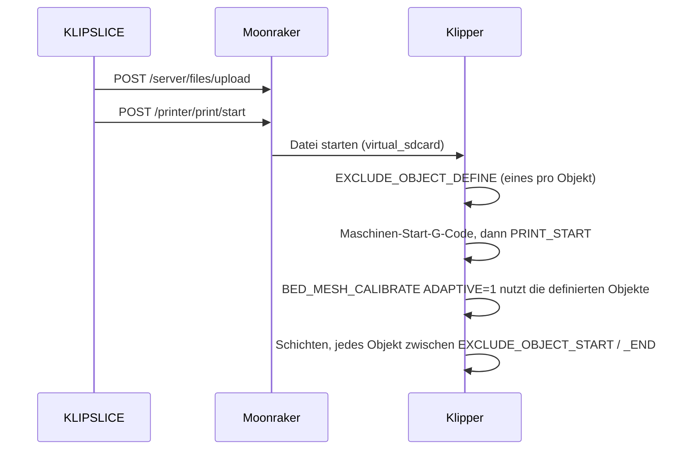

# Klipper-Einrichtung

Diese Seite beschreibt, was KLIPSLICE auf der Druckerseite erwartet: die
Klipper-Abschnitte, die Moonraker-Einstellungen und den Vertrag zwischen dem
Maschinen-Start-G-Code und deinem `PRINT_START`-Makro. Alles hier nutzt
Standardfunktionen von Klipper und Moonraker; zusätzliche Makro-Pakete sind nicht
nötig.

## Klipper-Abschnitte

### Von Moonraker vorausgesetzt

Moonraker braucht für den vollen Funktionsumfang drei Klipper-Abschnitte
([Moonraker: Klipper Configuration Requirements](https://moonraker.readthedocs.io/en/latest/installation/#klipper-configuration-requirements)).
Ist bereits ein `[filament_switch_sensor]` konfiguriert, wird `[pause_resume]`
automatisch geladen; ein `[display]` lädt `[display_status]` auf dieselbe Weise.

```ini title="printer.cfg"
[virtual_sdcard]
path: ~/printer_data/gcodes

[pause_resume]

[display_status]
```

[`[virtual_sdcard]`](https://www.klipper3d.org/Config_Reference.html#virtual_sdcard)
sorgt dafür, dass Klipper die G-Code-Dateien drucken kann, die KLIPSLICE über
Moonraker hochlädt. `path` muss auf Moonrakers `gcodes`-Verzeichnis zeigen; der
Wert oben ist der aus der Moonraker-Dokumentation.

### `[exclude_object]`

```ini title="printer.cfg"
[exclude_object]
```

[`[exclude_object]`](https://www.klipper3d.org/Config_Reference.html#exclude_object)
aktiviert die `EXCLUDE_OBJECT_*`-Befehle, mit denen sich einzelne Objekte während
eines Drucks abbrechen lassen
([Exclude Objects](https://www.klipper3d.org/Exclude_Object.html)). Der Abschnitt
ist außerdem die Datenquelle für adaptives Bed-Meshing: `BED_MESH_CALIBRATE
ADAPTIVE=1` nutzt die Umrisse der in der Datei definierten Objekte. Ohne
`[exclude_object]` fällt Klipper auf ein volles Mesh zurück.

In KLIPSLICE schaltest du dazu in den Prozesseinstellungen **Objekte
ausschließen** ein (*Sonstiges → G-Code-Ausgabe*). KLIPSLICE schreibt dann pro
Objektinstanz ein
[`EXCLUDE_OBJECT_DEFINE`](https://www.klipper3d.org/G-Codes.html#exclude_object_define)
mit `CENTER` und einem `POLYGON`-Umriss und klammert die Bewegungen jedes Objekts
mit `EXCLUDE_OBJECT_START` / `EXCLUDE_OBJECT_END`. Die Definitionen stehen **vor**
dem Maschinen-Start-G-Code, Klipper kennt sie also schon, wenn dein
`PRINT_START`-Makro läuft.

### `[gcode_arcs]`: nicht nötig

KLIPSLICE ist nicht auf `G2`/`G3` angewiesen. Klipper würde jeden Bogen ohnehin in
gerade Segmente zerlegen
([`[gcode_arcs]`](https://www.klipper3d.org/Config_Reference.html#gcode_arcs),
siehe [Vision & Fahrplan](vision.md#no-arc-fitting-for-klipper)). Lass **Als Bogen
drucken** (Arc Fitting, *Qualität → Präzision*) ausgeschaltet. Einige von
OrcaSlicer übernommene Prozessprofile schalten es ein, prüfe also das Profil, das du
verwendest. Ist Arc Fitting aktiv und fehlt `[gcode_arcs]`, akzeptiert Klipper die
`G2`/`G3`-Bewegungen nicht.

### `[bed_mesh]` für adaptives Meshing

Adaptives Meshing nutzt deinen normalen Abschnitt
[`[bed_mesh]`](https://www.klipper3d.org/Config_Reference.html#bed_mesh). Die
einzige Option speziell dafür ist `adaptive_margin`, der Rand in mm, der um den
Bereich der Objekte hinzukommt
([Bed Mesh: Adaptive Meshes](https://www.klipper3d.org/Bed_Mesh.html#adaptive-meshes)).
Er lässt sich auch pro Aufruf mit `ADAPTIVE_MARGIN=` setzen.

## Moonraker

### Verbindung

Lege in KLIPSLICE einen physischen Drucker mit dem Host-Typ **Moonraker** an und
trage die Moonraker-Adresse ein, zum Beispiel `http://printer.local:7125` (7125 ist
Moonrakers Standardport). KLIPSLICE nutzt diese Moonraker-Endpunkte:

| Endpunkt | Zweck |
|---|---|
| `GET /server/info` | Verbindungstest |
| `GET /server/files/roots` | Speicherorte auflisten |
| `POST /server/files/upload` | G-Code in den Speicherort `gcodes` [hochladen](https://moonraker.readthedocs.io/en/latest/external_api/file_manager/#file-upload) |
| `POST /printer/print/start` | Hochgeladene Datei drucken |

Verlangt Moonrakers Autorisierung in deinem Netz einen API-Schlüssel, trage ihn
ein. KLIPSLICE sendet ihn im Header `X-Api-Key`, den Moonraker für API-Schlüssel
vorsieht ([Moonraker: Authorization](https://moonraker.readthedocs.io/en/latest/external_api/authorization/)).

### `[file_manager] enable_object_processing`

Moonraker kann hochgeladene Dateien umschreiben und selbst Exclude-Object-Befehle
einfügen, wenn es Objekt-Markierungen findet
([Moonraker: `[file_manager]`](https://moonraker.readthedocs.io/en/latest/configuration/#file_manager)).
Mit aktivem **Objekte ausschließen** in KLIPSLICE enthält die Datei die Befehle
bereits, diese Vorverarbeitung ist also nicht nötig; die Klipper-Dokumentation
nennt native Slicer-Ausgabe und Verarbeitung beim Hochladen als zwei alternative
Wege, eine Datei vorzubereiten
([Exclude Objects](https://www.klipper3d.org/Exclude_Object.html)). Moonraker weist
darauf hin, dass die Verarbeitung viel Datei-I/O erzeugt und auf schwachen Hosts
wie einem Pi Zero nicht empfohlen ist. Lass die Option auf ihrem Standardwert:

```ini title="moonraker.conf"
[file_manager]
enable_object_processing: False
```

### Datei-Metadaten

G-Code-Dateien von KLIPSLICE nennen im Kopf weiterhin OrcaSlicer als Erzeuger.
Moonrakers Metadaten-Parser erkennt diesen Namen, deshalb liest Moonraker aus
KLIPSLICE-Dateien dieselben Metadaten wie aus OrcaSlicer-Dateien.

## Der `PRINT_START`-Vertrag

KLIPSLICE gibt keine Startsequenz fest vor. Der **Maschinen-Start-G-Code** des
Druckerprofils ist eine Vorlage; KLIPSLICE füllt die Platzhalter aus und schreibt
das Ergebnis an den Anfang der Datei. Bei Klipper-Druckern fügt KLIPSLICE rund um
diese Vorlage keine eigenen Heizbefehle ein: Bett und Düse werden dort geheizt, wo
die Vorlage es sagt, und nirgends sonst. (Einzige Ausnahme ist die
Druckraum-Temperaturregelung: Ist sie aktiv und enthält die Vorlage kein
`M141`/`M191`, stellt KLIPSLICE den Druckraum-Befehl vor die Vorlage.)

### Was das generische Profil sendet

Das Profil **Generic Klipper Printer** verwendet diesen Maschinen-Start-G-Code:

```gcode title="Maschinen-Start-G-Code (Generic Klipper Printer)"
M190 S[bed_temperature_initial_layer_single]
M109 S[nozzle_temperature_initial_layer]
PRINT_START EXTRUDER=[nozzle_temperature_initial_layer] BED=[bed_temperature_initial_layer_single]
```

Der Vertrag für ein Makro namens `PRINT_START` lautet also:

| Parameter | Wert | Einheit |
|---|---|---|
| `EXTRUDER` | Düsentemperatur der ersten Schicht für den ersten Extruder | °C |
| `BED` | Betttemperatur der ersten Schicht für die gewählte Druckplatte | °C |

Klipper übergibt Makro-Parameter als Zeichenketten in Großbuchstaben; vor
Rechenoperationen müssen sie mit `|float` oder `|int` umgewandelt werden
([Command Templates: Macro parameters](https://www.klipper3d.org/Command_Templates.html#macro-parameters)).

Herstellerprofile behalten Makronamen und Parameter der Klipper-Konfiguration des
jeweiligen Herstellers, zum Beispiel `START_PRINT EXTRUDER_TEMP=… BED_TEMP=…`.
Prüfe den Maschinen-Start-G-Code deines Druckerprofils, bevor du das Makro schreibst
oder änderst.

### Optionale Parameter

Diese Platzhalter stehen im Maschinen-Start-G-Code für weitere Parameter zur
Verfügung. Die Voron-Profile enthalten die Variante mit Druckraum und Druckbereich
als Kommentar:

| Platzhalter | Bedeutung |
|---|---|
| `[chamber_temperature]` | Druckraumtemperatur aus den Filamenteinstellungen |
| `{first_layer_print_min[0]}`, `{first_layer_print_min[1]}` | Linke untere Ecke (X, Y) des Druckbereichs der ersten Schicht |
| `{first_layer_print_max[0]}`, `{first_layer_print_max[1]}` | Rechte obere Ecke (X, Y) des Druckbereichs der ersten Schicht |
| `{total_layer_count}` | Anzahl der Schichten in der Datei |
| `[initial_tool]` | Index des ersten verwendeten Werkzeugs |

```gcode title="Erweiterte Variante (aus den Voron-Profilen)"
PRINT_START EXTRUDER=[nozzle_temperature_initial_layer] BED=[bed_temperature_initial_layer_single] Chamber=[chamber_temperature] PRINT_MIN={first_layer_print_min[0]},{first_layer_print_min[1]} PRINT_MAX={first_layer_print_max[0]},{first_layer_print_max[1]}
```

Parameternamen kommen im Makro in Großbuchstaben an (`Chamber` wird zu `CHAMBER`).

### Beispiel-Makro

Ein minimales `PRINT_START`, das den Vertrag einhält, bei fehlendem Parameter mit
einer klaren Fehlermeldung abbricht und nur den Bereich der Objekte abtastet:

```ini title="printer.cfg"
[gcode_macro PRINT_START]
description: Start sequence called from the KLIPSLICE machine start G-code
gcode:
  
    {action_raise_error("PRINT_START needs BED and EXTRUDER. Check the machine start G-code of the printer profile.")}
  
  
  
  M190 S{bed}
  G28
  BED_MESH_CALIBRATE ADAPTIVE=1
  M109 S{extruder}
```

[`action_raise_error`](https://www.klipper3d.org/Command_Templates.html#actions)
bricht das Makro und jedes aufrufende Makro ab; ein falsch konfiguriertes Profil
stoppt den Druck also, bevor sich etwas bewegt. Ergänze Homing-Varianten, Quad
Gantry Leveling oder Z-Tilt nach Bedarf deiner Maschine vor
`BED_MESH_CALIBRATE`.

!!! tip "Heizreihenfolge"

    Das generische Profil heizt Bett und Düse mit `M190`/`M109`, *bevor* es
    `PRINT_START` aufruft. Steuert dein Makro das Heizen selbst, etwa um mit kalter
    Düse zu proben, entferne diese beiden Zeilen aus dem Maschinen-Start-G-Code,
    damit die Düse nicht zu früh heizt.

### Was beim Start einer Datei passiert


