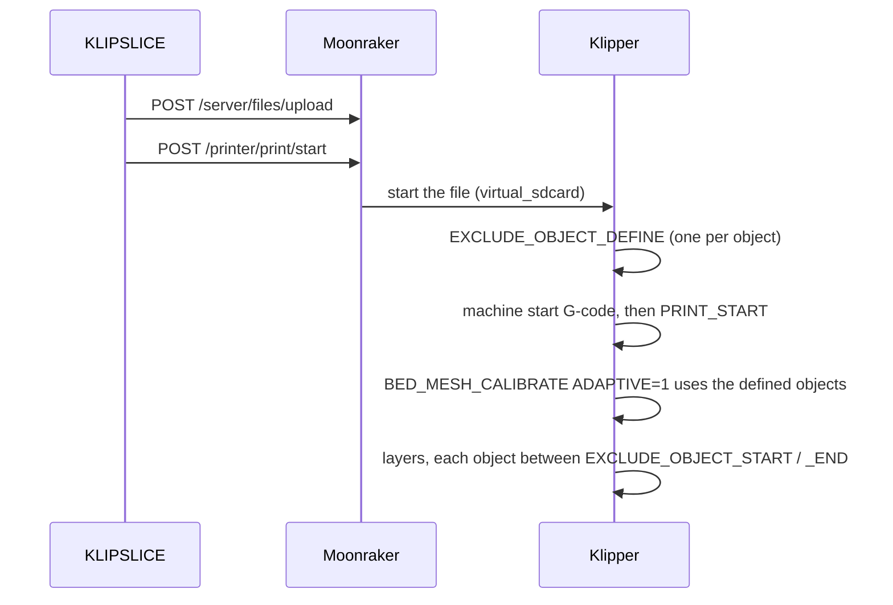

# Klipper setup

This page lists what KLIPSLICE expects on the printer side: the Klipper sections,
the Moonraker settings, and the contract between the machine start G-code and your
`PRINT_START` macro. Everything here uses stock Klipper and Moonraker features;
no extra macro packages are required.

## Klipper sections

### Required by Moonraker

Moonraker depends on three Klipper sections for full functionality
([Moonraker: Klipper configuration requirements](https://moonraker.readthedocs.io/en/latest/installation/#klipper-configuration-requirements)).
If your configuration already has a `[filament_switch_sensor]`, `[pause_resume]`
is loaded automatically; a `[display]` loads `[display_status]` the same way.

```ini title="printer.cfg"
[virtual_sdcard]
path: ~/printer_data/gcodes

[pause_resume]

[display_status]
```

[`[virtual_sdcard]`](https://www.klipper3d.org/Config_Reference.html#virtual_sdcard)
is what lets Klipper print the G-code files KLIPSLICE uploads through Moonraker.
`path` must match Moonraker's `gcodes` directory; the value above is the one used
in the Moonraker documentation.

### `[exclude_object]`

```ini title="printer.cfg"
[exclude_object]
```

[`[exclude_object]`](https://www.klipper3d.org/Config_Reference.html#exclude_object)
enables the `EXCLUDE_OBJECT_*` commands, so single objects can be cancelled during
a print ([Exclude objects](https://www.klipper3d.org/Exclude_Object.html)). It is
also the data source for adaptive bed meshing: `BED_MESH_CALIBRATE ADAPTIVE=1`
uses the outlines of the objects defined in the file. Without `[exclude_object]`,
Klipper falls back to a full mesh.

On the KLIPSLICE side, turn on **Exclude objects** in the process settings
(*Others → G-code output*). KLIPSLICE then writes one
[`EXCLUDE_OBJECT_DEFINE`](https://www.klipper3d.org/G-Codes.html#exclude_object_define)
per object instance, with its `CENTER` and a `POLYGON` outline, and wraps each
object's moves in `EXCLUDE_OBJECT_START` / `EXCLUDE_OBJECT_END`. The definitions
are written **before** the machine start G-code, so they are known to Klipper by
the time your `PRINT_START` macro runs.

### `[gcode_arcs]`: not needed

KLIPSLICE does not rely on `G2`/`G3`. Klipper would split every arc into straight
segments anyway ([`[gcode_arcs]`](https://www.klipper3d.org/Config_Reference.html#gcode_arcs),
see [Vision & roadmap](vision.md#no-arc-fitting-for-klipper)). Keep **Arc fitting**
(*Quality → Precision*) switched off. Some process profiles inherited from
OrcaSlicer switch it on, so check the profile you use. If arc fitting is on and
`[gcode_arcs]` is missing, Klipper will not accept the `G2`/`G3` moves.

### `[bed_mesh]` for adaptive meshing

Adaptive meshing uses your normal
[`[bed_mesh]`](https://www.klipper3d.org/Config_Reference.html#bed_mesh) section.
The only adaptive-specific option is `adaptive_margin`, the margin in mm added
around the objects' area ([Bed mesh: adaptive meshes](https://www.klipper3d.org/Bed_Mesh.html#adaptive-meshes)).
It can also be set per call with `ADAPTIVE_MARGIN=`.

## Moonraker

### Connection

In KLIPSLICE, add a physical printer with host type **Moonraker** and enter the
Moonraker address, for example `http://printer.local:7125` (7125 is Moonraker's
default port). KLIPSLICE uses these Moonraker endpoints:

| Endpoint | Purpose |
|---|---|
| `GET /server/info` | Connection test |
| `GET /server/files/roots` | List the storage roots |
| `POST /server/files/upload` | [Upload](https://moonraker.readthedocs.io/en/latest/external_api/file_manager/#file-upload) the G-code into the `gcodes` root |
| `POST /printer/print/start` | Start the uploaded file |

If Moonraker's authorization requires it for your network, enter an API key.
KLIPSLICE sends it in the `X-Api-Key` header, the header Moonraker defines for API
keys ([Moonraker: authorization](https://moonraker.readthedocs.io/en/latest/external_api/authorization/)).

### `[file_manager] enable_object_processing`

Moonraker can rewrite uploaded files and insert exclude-object commands itself
when it finds object tags
([Moonraker: `[file_manager]`](https://moonraker.readthedocs.io/en/latest/configuration/#file_manager)).
With **Exclude objects** enabled in KLIPSLICE the file already contains the
commands, so this preprocessing is not needed; the Klipper documentation lists
native slicer output and upload-time processing as two alternative ways to prepare
a file ([Exclude objects](https://www.klipper3d.org/Exclude_Object.html)).
Moonraker notes that the processing is file I/O intensive and not recommended on
low-resource hosts such as a Pi Zero. Leave it at its default:

```ini title="moonraker.conf"
[file_manager]
enable_object_processing: False
```

### File metadata

G-code files written by KLIPSLICE still name OrcaSlicer as their producer in the
header. Moonraker's metadata parser recognises that name, so Moonraker extracts
the same file metadata from KLIPSLICE files as from OrcaSlicer files.

## The `PRINT_START` contract

KLIPSLICE does not hard-code a start sequence. The printer profile's **machine
start G-code** is a template; KLIPSLICE fills in the placeholders and writes the
result near the top of the file. For Klipper printers, KLIPSLICE does not add any
heating commands of its own around that template: bed and nozzle are heated where
the template says so, and nowhere else. (The one exception is chamber temperature
control: if it is enabled and the template contains no `M141`/`M191`, KLIPSLICE
adds the chamber command before the template.)

### What the generic profile sends

The **Generic Klipper Printer** profile uses this machine start G-code:

```gcode title="Machine start G-code (Generic Klipper Printer)"
M190 S[bed_temperature_initial_layer_single]
M109 S[nozzle_temperature_initial_layer]
PRINT_START EXTRUDER=[nozzle_temperature_initial_layer] BED=[bed_temperature_initial_layer_single]
```

So the contract for a macro named `PRINT_START` is:

| Parameter | Value | Unit |
|---|---|---|
| `EXTRUDER` | First-layer nozzle temperature of the first extruder | °C |
| `BED` | First-layer bed temperature for the selected plate type | °C |

Klipper passes macro parameters as upper-case strings; convert them with `|float`
or `|int` before doing arithmetic
([Command templates: macro parameters](https://www.klipper3d.org/Command_Templates.html#macro-parameters)).

Vendor profiles keep the macro name and parameters of the vendor's own Klipper
configuration, for example `START_PRINT EXTRUDER_TEMP=… BED_TEMP=…`. Check the
machine start G-code of your printer profile before writing or changing the macro.

### Optional parameters

These placeholders are available for extra parameters in the machine start
G-code. The Voron profiles carry the chamber and print-area variant as a comment:

| Placeholder | Meaning |
|---|---|
| `[chamber_temperature]` | Chamber temperature from the filament settings |
| `{first_layer_print_min[0]}`, `{first_layer_print_min[1]}` | Lower-left corner (X, Y) of the first layer's print area |
| `{first_layer_print_max[0]}`, `{first_layer_print_max[1]}` | Upper-right corner (X, Y) of the first layer's print area |
| `{total_layer_count}` | Number of layers in the file |
| `[initial_tool]` | Index of the first tool used |

```gcode title="Extended variant (from the Voron profiles)"
PRINT_START EXTRUDER=[nozzle_temperature_initial_layer] BED=[bed_temperature_initial_layer_single] Chamber=[chamber_temperature] PRINT_MIN={first_layer_print_min[0]},{first_layer_print_min[1]} PRINT_MAX={first_layer_print_max[0]},{first_layer_print_max[1]}
```

Parameter names reach the macro upper-cased (`Chamber` arrives as `CHAMBER`).

### Example macro

A minimal `PRINT_START` that honours the contract, stops with a clear error when
a parameter is missing, and meshes only the area the objects use:

```ini title="printer.cfg"
[gcode_macro PRINT_START]
description: Start sequence called from the KLIPSLICE machine start G-code
gcode:
  
    {action_raise_error("PRINT_START needs BED and EXTRUDER. Check the machine start G-code of the printer profile.")}
  
  
  
  M190 S{bed}
  G28
  BED_MESH_CALIBRATE ADAPTIVE=1
  M109 S{extruder}
```

[`action_raise_error`](https://www.klipper3d.org/Command_Templates.html#actions)
aborts the macro and every macro that called it, so a misconfigured profile stops
the print before anything moves. Add homing variants, quad gantry levelling or
Z-tilt as your machine needs them, before `BED_MESH_CALIBRATE`.

!!! tip "Heating order"

    The generic profile heats bed and nozzle with `M190`/`M109` *before* it calls
    `PRINT_START`. If your macro controls heating itself, for example to probe
    with a cold nozzle, remove those two lines from the machine start G-code so
    the nozzle is not heated early.

### What happens when a file starts


